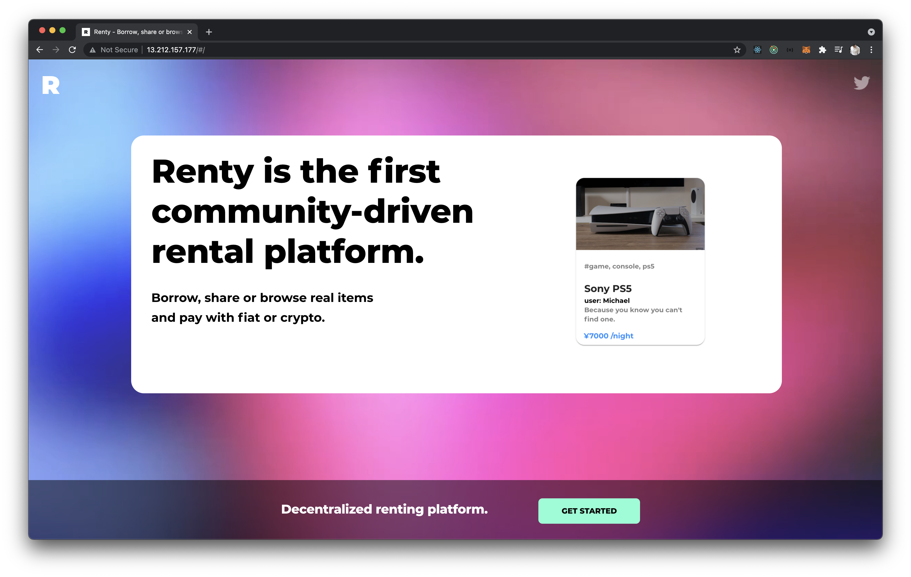

# Renty

A web3.0 ready rental marketplace - inspired by Mercari and Rarible.\
You can rent and borrow items using credit card and ethereum.
Please visit the site [here](http://rentyhq.com/#/)!




## Quick start

You will need to have a [MongoDB Atlas](https://www.mongodb.com/) instance, an [EmailJS](https://docs.ethers.io/v5/) account and [Stripe API](https://stripe.com/docs/api) key ready.

```
npm install
cp .env.example .env
npm run dev
```

## Technologies used

[React](https://reactjs.org/)\
[Axios](https://axios-http.com/docs/intro)\
[Bcrypt.js](https://www.npmjs.com/package/bcryptjs)\
[Email.js](https://www.emailjs.com/)\
[Ethers.js](https://docs.ethers.io/v5/)\
[JWT](https://jwt.io/)\
[Material-UI](https://material-ui.com/)\
[Moment.js](https://momentjs.com/)\
[MongoDB](https://www.mongodb.com/)\
[Mongoose.js](https://mongoosejs.com/docs/api.html)\
[React-carousel](https://www.npmjs.com/package/@brainhubeu/react-carousel)
[Redux](https://redux.js.org/)\
[Stripe API](https://stripe.com/docs/api)

## Authors

- [Mikio](https://github.com/eremitik)
- [Michael](https://github.com/vyridian17)
- [Alisher](https://github.com/AlisherU)
